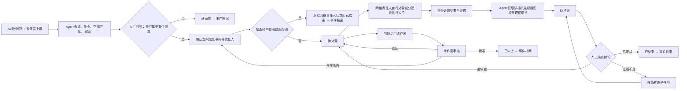

# 东城城运AI产品设计交接PRD（全量认知对齐版）

> **文档版本**：V2.3功能基线交接版 v1.0  
> **编制日期**：2026-08-18  
> **适用范围**：东城城指中心二期——城运AI PC端产品设计、需求拆解、研发实施与测试验收  
> **读者**：产品经理、交互设计师、视觉设计师、研发负责人、测试负责人、项目交付负责人  
> **文档性质**：产品认知真源。新加入的产品同学应先完整阅读本文，再进入原型或页面设计；本文未明确的事项不得自行补成业务规则。  
> **基线说明**：本文以 V2.3 已确认产品逻辑为唯一功能基线。V2.4 仅用于探索视觉与交互表现，不改变本文的业务规则、角色边界和功能范围；V3 系列探索方案不属于本次产品交接范围。

---

## 0. 先读这一页：产品同学必须形成的共同认知

### 0.1 城运AI不是“旧网格系统加一个聊天框”

东城原有平台是传统功能型城市治理 SaaS：用户在不同栏位中查案件、填字段、点操作、记流程。城运AI的目标不是把旧页面做得更漂亮，也不是把 AI 识别结果接进旧流程，而是新建一套能够**独立完成异常事件全生命周期闭环**的城市治理操作系统。

它的基本分工是：

- **Agent 做流程劳动**：查重、补全、匹配、取证、提醒、衔接外部反馈、持续监控、形成分析。
- **人做治理责任判断**：是否成立、是否立案、是否严重、是否需要外场核查、是否完成、是否中止、如何接管争议。
- **系统做可追溯治理**：每个动作、依据、规则版本、责任主体和结果均可回溯，并可被统计、比较和复盘。

一句话定义：

> **城运AI让用户不再推进流程，而是在 Agent 准备好的证据与行动草案上完成关键治理决定。**

### 0.2 本产品要解决的本质问题

| 旧系统问题 | 城运AI的解法 | 不能误做成什么 |
|---|---|---|
| 人要不断找案件、切栏目、填表、追状态 | Agent 按角色和状态把真正需要人工决定的事项送到工作区 | 一个“更好看的待办列表” |
| AI识别只是一条新的上报来源 | AI从发现开始参与信息准备、证据核验、流程接力和后效监测 | 识别结果旁边加一个“AI建议”标签 |
| 数据记录后只用于查单 | 数据沉淀为时效、质量、责任、复发、AI成效和作业指导依据 | 只有图表的统计看板 |
| 领导和操作人员使用同一套复杂页面 | 日常工作、终态回溯、统计洞察、跨域工作、领导汇报分成明确模块 | 所有人共用一个大而全门户 |

### 0.3 三条绝不可突破的产品原则

1. **AI 不替代最终责任。** 任何改变事件成立、责任、结案、中止等业务结果的动作，必须由具有权限的人确认并留痕。
2. **同一页面只服务一个核心决定。** 主视图只放直接证据、判断参考和操作所需；完整记录不是主视图的理由，默认按需展开。
3. **稳定结构，智能内容。** 不能做成每天进入都完全不同的“动态工作场”，让客户失去习惯；AI 应改变信息准备和优先级，而不是破坏熟悉的任务结构。

### 0.4 新产品同学最容易犯的错误

- 把“Agent处理池”做成给用户实时盯盘的技术监控页。
- 把“重复发生”继续放在事件档案入口，或放到领导大屏凑亮点。
- 把“AI工作台”退化成普通聊天页，遗漏文件记录和任务中心。
- 把所有页面内 AI 做成不同形态的输入框、弹窗、侧栏。
- 让 AI 写一段泛泛建议，而没有证据、风险、规则口径和动作后果。
- 让网格责任人/监督员在 PC 主流程里承担当前不在本期的手机端操作。
- 为了“AI感”增加无业务价值的光效、摘要、自动刷新或跳动数字。

---

## 1. 产品定位、目标与边界

### 1.1 产品定位

城运AI是面向东城区城市治理异常事件的 **AI + Agent 全生命周期治理平台**。它以相机视频识别和监督员人工上报为输入，以网格化责任处置为业务底座，以人工审核为责任锚点，以治理数据资产和持续分析为长期价值。

产品覆盖从“发现异常”到“结案/中止/无效归档”，再到“结案后复发识别与专题治理”的闭环；同时面向不同角色提供日常办理、终态追溯、统计洞察、跨域工作和领导汇报能力。

### 1.2 总体目标

将东城接入的相机和事件数据，从“能接进来”升级为：

1. **AI可理解**：对象、类型、位置、严重程度、时空关系和证据质量可被模型理解并形成判断参考。
2. **业务可追溯**：发现、人工决定、派发、反馈、核查、退回、中止、升级、规则版本均可还原。
3. **治理可配置**：治理范围、分类、等级、时限、责任边界、自动结案、复发阈值、批次和回收规则可被管理。
4. **效果可评估**：事件发生、流程运行、人员作业、治理质量、AI实际作用和复发治理效果可持续评估。

### 1.3 成功标准

- 新系统在核心治理链路上可脱离旧系统独立运行。
- 人工填写和手动推进显著减少，但所有关键治理决定仍由人承担。
- 任何终态事件都能还原“发生了什么、谁做了什么、依据什么规则、为何得出该结论”。
- 同类事件在不同网格、人员、区域和时段的处置时效及质量可比较，且比较口径可解释。
- 系统能识别重复上报、结案后复发、长期未消失或高频区域等“单次工单看不出来”的治理问题。
- 操作人员、管理人员和领导均能在低学习成本下找到自己要做的事或要看的结果。

### 1.4 本期范围

| 范围 | 本期纳入 | 说明 |
|---|---|---|
| 终端 | PC端 | 立案审核、核查结案、全局协调、管理人员、领导使用 |
| 移动端输入 | 纳入结果接口 | 网格责任人、二级执行人员、监督员的移动端页面不在本期展开，但其反馈必须能进入事件链路 |
| 业务对象 | 异常事件、现场核查子任务、重复上报记录、复发治理专题、配置版本、AI对话/文件/任务 | 详见第4章 |
| 一级模块 | 治理大屏、AI实时治理、事件档案、AI统计、AI工作台、治理配置 | 固定为6个 |
| 数据底座 | 通过接口接入 | SeeTime AI数据中心及相机接入、脱敏、图像预处理、模型运维不属于城运AI页面范围 |

### 1.5 明确不做或暂缓

- 在旧网格化系统内做局部改版或嵌入式升级。
- 网格责任人、二级执行人员、监督员的移动端完整工作空间。
- 将一个事件拆为多个并行处置工单的复杂协同机制。
- 客户可随意拖拽重建主流程的流程设计器。
- 对事件档案进行自然语言批量修改。
- Agent 自动替人完成高风险业务决定或低风险自动执行业务变更。
- AI统计自动推送统计异常；当前只提供按需解读，主动推送另行确认。
- V3/V3.1 的新体验母体或重构型信息架构。

---

## 2. 角色、权限与责任边界

### 2.1 角色总表

| 角色 | 主要终端 | 在系统中的核心任务 | 可以做 | 不可以做 |
|---|---|---|---|---|
| 立案审核角色 | PC | 判断候选是否成立，补全并确认立案信息，确定网格责任人 | 判无效、修改需确认字段、确定网格责任人、立案并派发 | 对处置结果直接结案；替网格人员现场处置 |
| 核查结案角色 | PC | 判断处置是否完成，决定结案、退回、外场核查、作废审核 | 结案、退回处置、发起外场核查、审批作废 | 替立案角色改写事件成立标准；自行删除事件 |
| 全局协调角色 | PC | 接管争议、升级或无法裁定的事项 | 全量查看、直接接管并完成闭环、跨层级协调 | 绕过操作留痕或规则版本 |
| 网格责任人 | 移动端为主 | 接收本网格事件，自行处置或派给二级执行人员 | 自行处置、手工分配二级执行人员、提交处置结果、退回定责、申请作废 | 自行将事件中止或最终结案 |
| 二级执行人员 | 移动端为主 | 执行网格责任人分配的现场处置 | 提交处置结果、证据及无法处置说明 | 自行变更网格责任；最终结案 |
| 监督员 | 手机APP | 接收辖区内现场核查任务，提交外场核查结果 | 提交已处置/未处置、现场图、时间、定位和说明 | 最终结案、改变事件责任链 |
| 领导/管理人员 | PC | 看态势、洞察、汇报和跨域分析 | 使用治理大屏、AI统计、AI工作台 | 承担日常审核任务，除非另有审核角色权限 |

### 2.2 默认数据可见范围

- **待立案**：为尚未分发的全量候选事件；符合权限的立案角色可见。
- **待核查、待作废审核**：用户默认只获得 Agent 分发给自己的当前批次；完成本职批次后可协助其他审核职责，但仍遵循批次分配和权限控制。
- **网格责任人**：默认仅见本网格事件。
- **二级执行人员**：默认仅见分配给自己的事件。
- **监督员**：默认仅见自己辖区和已派发给自己的核查任务。
- **全局协调角色**：可查看下级升级、重大和争议事件，并可接管。
- **AI工作台**：只能使用当前账号已有的数据与操作权限，不能通过自然语言越权。

### 2.3 角色协作原则

立案审核与核查结案是两个职责，但不是两个彼此隔绝的页面世界。系统应根据账号侧重决定默认优先级；当某人处理完自己当前主要工作后，可按权限协助另一类审核工作。系统不需要展示“同岗位其他人刚刚处理了什么”，避免无价值的工作噪音。

---

## 3. 信息架构与模块边界

### 3.1 一级模块

| 一级模块 | 核心用户问题 | 数据边界 | 不承担的职责 |
|---|---|---|---|
| 治理大屏 | 东城当前治理情况如何，哪些严重问题值得汇报？ | 全区实时态势与重大事件 | 日常办理、泛问答、复发专题治理 |
| AI实时治理 | 此刻哪些事项需要我做最终判断，Agent已准备到什么程度？ | 存续事件、人工批次、稳定运行状态 | 终态档案检索、全局报表分析 |
| 事件档案 | 已结束的一个事件最终怎么处理、依据什么、有没有风险？ | 已结案、已中止、已无效 | 存续事件办理、重复发生专题入口 |
| AI统计 | 哪类问题、流程或治理效果正在变化，管理上应如何判断？ | 全量/完成/存续事件的口径化统计 | 自由文件管理、事件日常办理 |
| AI工作台 | 跨模块、跨时段我要查询、分析、生成材料或设置任务什么？ | 账号权限内全量数据、对话、文件、任务 | 代替当前页面上下文AI |
| 治理配置 | 哪些规则决定业务结果，谁可发布并追溯历史影响？ | 组织、空间、事件、流程、Agent、评价配置 | 自由重构主流程、模型训练运维 |

### 3.2 事件档案、重复发生与治理大屏的边界

这是本产品最容易混淆的三件事，必须严格区分。

| 概念 | 归属 | 含义 | 处理方式 |
|---|---|---|---|
| 重复上报 | 原事件生命周期 | 同一现实问题被AI或人工再次报告 | 不建新事件，仅追加“人工重复上报”或“AI重复识别”记录 |
| 结案后复发 | 新事件与历史事件关系 | 原事件已闭环，后续同位置/同相机、同类问题再次出现 | 创建新事件，与历史事件建立复发关联 |
| 复发治理专题 | AI统计 > 专题统计 | 多次新事件构成反复发生、未被真正解决的治理问题 | 聚合分析、观察治理措施效果；不作为事件档案入口，也不放领导大屏 |

### 3.3 AI工作台与页面内上下文AI的边界

| 能力 | AI工作台 | 页面内上下文AI |
|---|---|---|
| 使用场景 | 跨模块、跨时段、跨对象的工作 | 解释或控制当前页面、当前范围、当前引用对象 |
| 数据范围 | 账号权限内全量治理数据 | 当前模块明确的数据集 |
| 核心产出 | 对话、文件、定时任务、条件监控、受控业务操作 | 当前业务视图的解释、筛选、定位、排序或图表解读 |
| 页面关系 | 独立一级模块 | 附着于AI实时治理、事件档案、AI统计 |
| 是否能执行业务操作 | 可以，但必须走操作预检与人工确认 | 仅实时治理可做当前批次范围内的筛选、排序、带条件获取；不能抢占主视图或越权变更 |

**页面内上下文AI统一交互语法：**使用模块化身份（治理助手、AI查档、AI解读），明确当前范围和引用对象，支持多轮对话和场景化推荐问题；标准态与展开态均与业务页面并排，不得遮挡业务内容。只有用户主动全屏时才允许覆盖。

---

## 4. 核心业务对象与数据模型

### 4.1 异常事件

异常事件是系统最小且唯一的治理主对象。**一个事件等同于一个处置任务，任何时刻只对应一个网格责任人，不拆分成多个并行主任务。**

#### 4.1.1 事件主数据字段

| 字段组 | 字段 | 来源/维护方式 | 设计要点 |
|---|---|---|---|
| 身份 | 事件ID、来源事件ID、创建时间、任务渠道 | 系统 | 事件ID是档案和审计主键 |
| 发现 | 问题来源、发现时间、发现图/视频帧、相机ID、识别持续时间 | AI数据中心/监督员 | 必须保留原始发现证据 |
| 分类 | 问题类型、大类、小类、小类明细、微类 | Agent预填 + 人工确认 | 分类字典来自配置版本 |
| 判断 | 是否属于事件范围、事件等级、严重程度、成立规则命中项 | Agent建议 + 人工决定 | 规则、建议与人工决定分开存储 |
| 空间 | 经纬度、位置描述、街道、社区、网格、图层区域、相机位置 | Agent空间匹配 + 人工校正 | 位置点变化必须同步刷新文字位置描述及责任匹配 |
| 责任 | 网格责任人、二级执行人员、监督员、审核人、升级接管人 | 流程动作产生 | 网格责任人唯一；二级执行人员可为空 |
| 处置 | 处置结果、反馈时间、反馈说明、处置后图、无法处置原因 | 移动端/外部接口 | 人员反馈和Agent判断不能混写 |
| 终态 | 最终状态、终态时间、结案结论/中止原因、核查意见 | 人工决定 | 已无效、已中止、已结案均进入档案 |
| 风险 | 复发关联、重复上报记录、观察期、升级标识 | Agent/人工 | 当前事件若仍存续，不出现在档案列表 |
| 审计 | 创建人、操作记录、字段版本、规则版本、证据版本 | 系统 | 所有历史不可覆盖 |

#### 4.1.2 字段填写责任

1. **系统确定字段**：事件ID、来源、发现时间、原始图片、接口状态等，由系统写入，不让用户反复确认。
2. **Agent自动填充字段**：类型、描述、位置、网格、责任方候选、等级、重复风险、证据完整度等。Agent填充并不等于最终成立。
3. **必须人工确认字段**：事件范围、严重程度/等级（若规则要求）、关键分类、责任网格、是否结案、是否作废、是否需要外场核查。
4. **人工可修正字段**：位置描述、事件描述、分类、责任方等；修改必须保留前后值、原因和时间。

### 4.2 现场核查子任务

现场核查是原事件的子任务，不生成新的治理主事件。其数据包括：派发对象、辖区匹配依据、送达时间、现场图、拍摄时间、定位、核查结论、说明和回传时间。子任务结束后，原事件回到待核查，由核查结案角色完成最终判断。

### 4.3 Agent行动草案

任何需要人决定的 Agent 输出，必须是可审查的行动草案，而不是一句“建议”。对象至少包含：

| 固定区块 | 必须回答的问题 |
|---|---|
| 建议结论 | Agent希望用户批准、修正还是拒绝什么？ |
| 依据证据 | 哪些图片、识别结果、空间关系、历史事件、人员反馈支持该结论？ |
| 风险点 | 哪些证据不完整、置信度不足、规则冲突或后果需要用户警惕？ |
| 规则版本/口径 | 本判断适用哪个事件标准、时限、自动结案或统计口径版本？ |
| 后续动作与影响 | 用户点击不同决定后，系统将推进到哪里、通知谁、是否改变时限或责任？ |

### 4.4 复发治理专题

专题以“问题模式”而不是某一个事件为主对象。它至少应保存：专题ID、候选规则、关联事件集合、同类/同位置/同相机证据、复发次数、间隔、治理措施、观察期、当前判断和最终治理结论。专题成立阈值由配置定义；产品不得自行写死某个次数或时间窗口。

### 4.5 证据对象

每份证据需要记录来源、采集时间、位置、关联事件、图像质量、真实性校验结果、是否为核心证据、是否被人工采用。

核心三类图片：

1. **发现图**：事件被发现时的相机画面或人工上报图片。
2. **处置后图**：收到处置反馈后从原相机获取的最新截图。
3. **现场核查图**：一线人员手机拍摄上传的图片。

判断优先级：先比较发现图与同一相机的处置后图；若后图遮挡、转向、画质不足，才以发现图与现场核查图辅助判断，并校验手机图的时间、GPS、真实性与复用风险。

### 4.6 操作记录与规则版本

操作记录不仅是审计日志，也是后续优化的数据资产。每条记录至少包含：动作主体（人/Agent/外部系统）、时间、状态前后值、字段前后值、使用证据、规则版本、动作结果、下一步责任主体。

它还将用于计算流程等待、人员作业时效、退回原因、规则调整前后效果、最佳实践和Agent有效性。**“留痕”不是把全部日志堆在首屏，而是保证需要追溯时能够完整还原。**

---

## 5. 事件状态模型与完整流转

### 5.1 四条并行状态轴

产品不能只用一个“状态”描述所有事情。至少区分以下四轴：

| 状态轴 | 作用 | 示例 |
|---|---|---|
| 业务主状态 | 事件在治理生命周期的阶段 | 待立案、待处置、待核查、已结案 |
| 责任状态 | 当前谁应承担下一步 | 立案审核、网格责任人、监督员、核查结案、全局协调 |
| Agent运行状态 | Agent在稳定地等待或监控什么 | 待分配、等待处置反馈、等待外场核查、持续监控 |
| 证据完整度 | 当前证据是否足够支撑判断 | 可判断、证据不足、需外场核查、图片真实性待核验 |

不要把“Agent处理中”作为用户可见稳定状态。它是短时技术动作，频繁显示只会制造跳动与困惑。

### 5.2 业务主状态定义

| 状态 | 进入条件 | 下一步 | 终态/存续 |
|---|---|---|---|
| 待立案 | 事件被发现，Agent完成初步准备 | 人工判无效或确认立案派发 | 存续 |
| 待处置 | 已立案并派给网格责任人 | 处置反馈、退回定责、申请作废 | 存续 |
| 待核查 | 处置反馈与证据已准备 | 结案、退回处置、发送外场核查 | 存续 |
| 核查不通过 | 核查确认未完成 | 返回原责任人继续处置 | 过程状态，不作为独立终态页面 |
| 待作废审核 | 处置方到场后确认客观无法处置/需协调并提交材料 | 批准中止、驳回处置、退回立案、升级 | 存续 |
| 已结案 | 核查结案角色确认完成，或命中自动结案规则 | 归档、持续复发监测 | 终态 |
| 已中止 | 作废审核批准，或合法中止决定完成 | 归档 | 终态 |
| 已无效 | 立案阶段确认不属于事件范围 | 归档 | 终态 |

### 5.3 主流程

### 5.4 立案阶段

#### 5.4.1 Agent要完成什么

- 判重，识别是否已存在同一现实问题的存续事件。
- 从图像/上报材料中预填类型、描述、事件等级候选、位置、网格和网格责任人。
- 展示发现图、相机位置、事件位置和空间归属。
- 标记需要人工确认的低置信字段和规则冲突。
- 给出可审查行动草案。

#### 5.4.2 人工要完成什么

立案审核角色只做一个核心决定：**这是否是需要立案派发的城市治理事件？**

若否，选择“不属于事件范围”，事件进入已无效。已无效不是删除，必须进入档案，保留发现证据、人工理由和规则依据。

若是，用户对必须确认的字段进行确认/修正，特别是网格责任人。完成立案即表示：事件成立、关键描述完整、唯一网格责任人确定、派发动作完成。

#### 5.4.3 位置与地图交互

- 现场画面和空间地图必须能在同一决策页面并行使用；不能让用户在两个页面之间来回切换。
- 图像与地图的边界支持拖动调整，满足“先看图还是先校位置”的不同工作习惯。
- 地图应显示相机位置、事件位置、网格边界和必要的周边参照。
- 用户点选/拖动事件位置后，右侧案件信息中的位置描述、街道/社区/网格、责任匹配和需确认提示必须同步更新。
- 若空间自动匹配失败，不能完成立案；必须提示立案角色人工确定。

### 5.5 待处置与责任争议

网格责任人收到事件后，系统自动记录送达、已读和首次查看；不要求手动“签收”。处置计时从派发成功开始。

网格责任人有三种主要路径：

| 场景 | 网格责任人动作 | 系统流转 |
|---|---|---|
| 自行处置 | 提交处理成功与现场反馈 | Agent补齐处置后证据 → 待核查 |
| 分配二级执行人员 | 手工选择执行人员并跟踪反馈 | 主状态仍为待处置；二级人员反馈回到原事件 |
| 不属本人管辖 | 退回并说明 | 返回“补全信息并确定网格责任人”环节，重新立案派发 |
| 客观无法处置/需协调 | 到场后提交原因、材料与证据 | 进入待作废审核 |
| 现场已消失/与上报不一致 | 提交证据与说明 | 进入待核查，由核查结案角色判断是否可结案 |

网格责任人和二级执行人员均不能自行终止或最终结案事件。

### 5.6 核查、结案与外场核查

核查结案角色的核心决定：**当前证据是否足以证明问题已被解决？**

页面必须以图片为主：左侧发现图，右侧处理后最新图；采用可拖动的前后对比，支持全屏放大。不得让Agent文字结论覆盖主画面。

核查结论只有三条：

1. **确认完成并结案**：进入已结案。
2. **未完成，退回处置**：回到原网格责任人，记录退回理由。
3. **证据不足，需要监督员核查**：由人工判断是否需要，不由Agent自动触发；派发给事件发生地辖区内监督员。

监督员只提交“已处置/未处置”及现场证据，不做最终结案决定。收到外场核查结果后，原事件回到待核查。

### 5.7 作废审核与中止

作废申请并非“未处理就想取消”。原则是：**网格处置方通常需要到场判断客观无法处置后，才能申请作废。**

待作废审核页面的主证据是申请方图片与原因：图片在上，原因紧随其后；材料是选填，有数据才展示。处置过程仅以摘要按需展开，不能抢占主判断。

审核结果：

- 批准：事件进入已中止，完整保留申请、材料、审核意见和生命周期。
- 驳回：退回原责任人继续处置。
- 责任归属错误：退回立案阶段重新确定网格责任人。
- 无法裁定：升级给全局协调角色。

### 5.8 自动结案

部分事件类型满足预设条件（例如特定时间段、特定规则组合）时，无需处置反馈和人工核查。立案角色确认事件并派给网格责任人后，系统立即结案。

自动结案规则必须在治理配置中管理，并在事件生命周期记录中写入命中规则版本、派发对象、触发时间和自动结案原因。自动结案不是“没有过程”，而是规则允许省略人工处置与核查环节。

### 5.9 升级与接管

升级是事件上的权限标记，不是独立事件类型或独立一级菜单。具备上级权限的全局协调角色能够看到下级升级事项，并可直接接管完成闭环。任何接管都要记录原责任主体、接管原因、接管人、时间和后续决定。

---

## 6. Agent处理池、批次分配与回收机制

### 6.1 为什么要有批次，而不是所有待办平铺

如果将所有待立案、待核查和待作废审核事件同时展示，用户会回到旧系统的“找事做”模式；若事件被他人认领后动态消失，用户又会陷入“盯盘”和不断寻找剩余事件的体验。

因此，人工工作采用 **Agent分批投放 + 人工完成关键判断 + Agent接力** 的机制。用户不挑简单任务，也不需要知道全区全部待办如何变化；系统让每个人明确知道当前自己应完成的一批工作。

### 6.2 三类独立人工批次

| 批次 | 面向谁 | 批次内事件 | 默认数量 | 可否混合 |
|---|---|---|---|---|
| 待立案 | 立案审核角色 | 等待成立判断与派发的候选事件 | 10件，可配置 | 不与待核查/待作废混合 |
| 待核查 | 核查结案角色 | 处置反馈已到、等待核查判断的事件 | 10件，可配置 | 独立领取 |
| 待作废审核 | 核查结案角色 | 处置方申请作废的事件 | 10件，可配置 | 独立领取 |

普通用户不能从共享队列挑选单个事件，也不能抢占已分给他人的批次。同一事件同一时刻只能进入一个人的一个批次；全局角色可按权限接管。

### 6.3 领取、完成与下一批

1. 用户进入分类后，看到当前批次及其处理进度。
2. 用户完成一件决定，事件立即交还 Agent 执行后续动作。
3. 同类当前批次完成或接近完成时，页面提供“获取最新一批”入口；Agent依据角色、事件优先级、时限、严重程度和当前负荷形成新的批次。
4. 页面不使用自动刷新来悄悄替换批次。若后台数量变化，只给出明确刷新提示或刷新按钮，避免用户丢失上下文。

### 6.4 排序与优先级

系统强优先级包含：严重事件、临近/已超时事件、升级事件、证据风险事件等。用户可调整“待立案、待核查、待作废审核”三个分类的前后顺序，仅影响本人界面偏好；严重事件可以突破个人顺序置顶。

### 6.5 回收机制

回收既要避免任务长期占用，也不能让用户在不知原因时发现数量突然变少。

- 未开始或处理中事件，连续 **30分钟** 无有效业务操作时进入回收预告；时长应配置化。
- 回收前提前提醒。有效操作包括查看核心证据、切换证据帧、修改字段、调整地图、填写意见、提交判断等；单纯停留页面或鼠标移动不算。
- 账号停用、角色移除、人员转岗等情况应立即释放批次，并保存草稿、原优先级和累计等待时长。
- Agent确认候选事件自然消散、无需立案时，不应让事件无声消失；在立案批次中保留只读状态“自然消散，无需立案”，不允许编辑，并记录识别依据。
- 用户主动“结束工作批次”本期不提供，避免产生消极处理激励。

### 6.6 Agent处理池的固定四态

Agent处理池是对存续事件进行按需追溯的稳定运行视图，不是用户主待办。

| 状态 | 含义 | 用户在详情首屏应先看到什么 |
|---|---|---|
| 待分配 | 事件已具备进入下一责任方的条件，但尚未完成责任分配 | 当前卡点、缺什么条件、待分配给谁/何种角色 |
| 等待处置反馈 | 已派给网格责任人，等待现场处置结果 | 当前责任人、已等待多久、时限风险、下一触发条件 |
| 等待外场核查 | 已向监督员派发外场核查，等待反馈 | 监督员、辖区匹配、已等待多久、需要的证据 |
| 持续监控 | 事件已终态或进入规则要求的持续观察 | 观察对象、监控规则、何种条件会形成后续动作 |

不展示短时快速变化的“Agent处理中”。处理池交互为：**处理池概览 → 点击状态查看事件列表 → 点击事件进入只读运行详情**。不使用弹窗，以保证详情宽度可承载状态、证据和接力轨迹；列表应支持筛选与搜索。

---

## 7. 六个一级模块的详细需求

## 7.1 治理大屏

### 7.1.1 定位与用户

治理大屏是面向内部/外部政府领导的默认首页和汇报空间。它的价值是快速建立“东城正在被AI持续治理”的信心，并支持领导在有限时间内理解全区态势、严重风险和空间分布。

它不是日常办理页、不是报表大杂烩、也不是泛问答入口。

### 7.1.2 固定页面结构

| 区域 | 内容 | 交互规则 |
|---|---|---|
| 顶部总览 | 东城区实时整体情况：存续事件、今日闭环、严重事件、平均处置时长等 | 只反映全区，不随地图选择联动 |
| 左侧上 | 生命周期脉冲：发现、立案、处置、核查、结案等阶段数量与关键风险 | 点击某阶段，地图按该阶段事件状态显示强弱 |
| 左侧下 | 高发网格TOP5：存续事件最多的5个网格名称及数量 | 只做排名展示，不与地图联动 |
| 中央 | 街道地图，区域颜色/强弱和点位表达事件严重程度 | 可选择街道进入局部视角；支持回到全域 |
| 右侧 | AI当前关注：默认展示3个严重事件，图片优先、事件信息在图下，容器内向下滚动查看更多 | 点击事件可聚焦地图/查看摘要；不承担办理 |

### 7.1.3 设计要求

- 顶部不是“联动控制条”，必须保持全区总况，避免领导失去宏观锚点。
- 地图强弱代表严重程度，不能仅用颜色美化；生命周期筛选后必须改变地图呈现的状态强弱。
- 当前关注中的图片要足够大，用户能一眼识别现场问题，不应只显示小缩略图和长文字。
- 删除无明确价值的“恢复默认视图”等装饰性交互；保留必要的回到全域即可。
- 不设置常驻AI输入框。大屏强调“AI已经在持续工作并解释”，不是要求领导现场操作聊天。

### 7.1.4 验收问题

- 领导在10秒内能否说出全区当前是否平稳、是否有严重事件、严重问题大致在哪里？
- 点击生命周期“待核查”后，地图是否准确切换为待核查事件的空间严重度？
- AI当前关注是否默认仅展示严重事件，且图片和事件信息都可读？

## 7.2 AI实时治理

### 7.2.1 定位

AI实时治理是操作人员处理存续事件的主工作区。它服务的不是“查看所有数据”，而是“完成当前必须由我承担的关键判断”。导航归属必须始终高亮 **AI实时治理**，不能被错误归到治理配置等模块。

### 7.2.2 首页与工作区

首页的最小目标：用户清楚看到待立案、待核查、待作废审核三类独立工作批次，以及Agent处理池这一按需运行视图。不要平铺所有待办，也不要把Agent处理池和人工任务混成一个列表。

首页可呈现：

- 三类人工批次的数量、当前处理状态、临近超时/严重风险提示和“获取最新一批”入口。
- 用户可手动调整三类分类的显示顺序。
- Agent处理池入口及四态数量；进入后再浏览，不抢占人工工作区。
- 可选的当前批次范围内“治理助手”，仅用于筛选、排序、带条件获取，不作为泛问答主入口。

### 7.2.3 待立案决策页

**唯一核心决定：这是否属于需要立案的城市治理事件？若是，是否能以正确责任方完成立案派发？**

页面主结构：

1. 任务上下文：事件ID、来源、发生时间、当前状态、本批第几件、返回工作列表。
2. 主证据区：发现画面与可切换前后帧；图片放大；可与地图并排、拖动调整比例。
3. 地图与位置校准区：相机位置、事件位置、网格、位置文字联动。
4. 可审查判断区：建议结论、证据、风险点、规则口径、后续动作与影响。
5. 案件信息区：只展示本次决定必需字段；Agent已填、需确认、用户已修改三种来源状态清楚区分；次要字段向下滚动获取。
6. 最终动作：不属于事件范围 / 确认立案并派发。动作后明确Agent下一步。

**禁止：**复制旧系统的大表单；将“查看完整案件信息”“检查全部信息”等无动作价值按钮放在主视图；让地图与现场图片只能二选一；让Agent判断覆盖图片。

### 7.2.4 待核查决策页

**唯一核心决定：处置是否确已完成、是否可结案？**

- 左侧使用发现图与处置后最新图的拖动对比；左为发现，右为处置后，不能反向。
- 处置后图优先使用原相机的最新截图；若不可判断，才引入手机核查图并展示真实性校验。
- 图片下方只放简洁的画面变化结论，不与右侧Agent判断重复。
- 右侧上部为Agent可审查判断，默认展示建议结论，详情按需展开；右侧下部为处置方反馈，按主次显示。
- 事件时间轴保留，但压缩为可展开的追溯信息。
- 最终动作：确认结案 / 退回继续处置 / 发送监督员核查。

### 7.2.5 待作废审核页

**唯一核心决定：这次客观无法处置是否成立，是否应以中止结束？**

- 左侧以申请方现场图片为主，申请原因紧随图片，申请材料仅在有值时展示。
- 右侧提供Agent审核草案，默认收起依据细节，避免占据证据空间。
- 完整事件过程不是第一屏刚需，仅提供摘要和按需展开。
- 最终动作：批准作废并中止 / 驳回继续处置 / 退回立案重新定责 / 升级接管。

### 7.2.6 实时治理上下文AI：治理助手

治理助手只服务当前操作人员、当前存续工作范围。可支持的场景：

| 场景类别 | 示例 | 结果承接 |
|---|---|---|
| 当前批次筛选 | “只看严重的待立案事件” | 在当前批次列表形成可见筛选结果 |
| 当前批次排序 | “把临近超时的排在前面” | 改变当前列表排序并显示生效范围 |
| 带条件获取 | “优先给我严重的待立案事件” | 对下一批获取条件形成预览，仍需满足分配规则 |
| 当前事件解释 | “为什么这个位置需要确认？” | 回答当前事件字段/证据/规则，不跳到宏观分析 |

不支持：查询全区等待事项、全局调度、接管其他人的事件、领导态势分析。这些是管理或跨模块场景，应进入治理大屏/AI工作台。

## 7.3 事件档案

### 7.3.1 定位与范围

事件档案只承载已结案、已中止、已无效事件。它回答：**一个已经结束的事件最终是什么结论，证据是否可靠，过程是否可追溯，是否存在后续风险。**

存续事件不显示在档案；若低频重新激活，事件回到待立案并从当前档案结果中移出，同时保留历史终态记录。

### 7.3.2 档案列表

- 以事件ID为基本单位排序和展示，不按相机自动聚合。
- 列表核心字段：事件ID、最终状态、事件类型、位置/相机、发生时间、完成时间、审核人、网格处置人员、总处置时长。
- 页面保留高频筛选：最终状态、时间、事件类型、街道/区域；更多复杂条件由AI查档完成，不把页面变回传统筛选器森林。
- 快捷搜索用于精确定位事件ID、位置或关键词；它不等同AI查档。

### 7.3.3 右侧完整档案面板

默认展示终态复盘，而不是一上来铺满生命周期：

1. 最终结论和总处置时长。
2. 关键证据：发现图与处理后图/核查图。
3. Agent最终判断：说明结论与证据一致性。
4. 复发风险：仅显示风险结论与“专题统计中可查看”路径；不提供重复发生详情入口。
5. 按需展开：生命周期、规则版本、人工/Agent操作记录、档案更正历史。

面板必须独立滚动至底部；支持上下箭头切换事件与全屏查看；关闭面板后列表自动填满可用区域，不能留下右侧空白。

### 7.3.4 AI查档

AI查档有两类明确能力：

1. **多参数条件查档**：跨事件字段筛选。如“查近30天北新桥街道、共享单车占道、核查退回过一次且处置时长超过4小时的已结案事件”。
2. **档案内部追溯**：跨一个或多个档案的事件过程、证据、人工判断、规则版本、修改记录、重复上报记录等进行检索和比较。

AI查档结果必须回到档案列表或面板中可见地承接；不是只在聊天中返回一段文字。它不能修改档案数据。

### 7.3.5 档案更正

允许具备权限的人员更正档案字段，但所有更正必须记录前后值、修改原因、修改人、时间和影响范围。批量修改和自然语言直接修改不属于本期。

## 7.4 AI统计

### 7.4.1 定位

AI统计不是“带聊天框的报表”，而是围绕一个管理判断组织 **变化—证据—解释—行动** 的数据分析产品。它提供口径稳定、可反复查看的高频统计；临时跨域分析和材料生成由AI工作台负责。

### 7.4.2 七类固定统计

| 分类 | 管理问题 | 核心指标/图表方向 | 典型行动 |
|---|---|---|---|
| 综合态势 | 总量、存量和闭环趋势是否异常？ | 发现/闭环趋势、存续量、严重事件、平均时长 | 识别全区风险与优先治理方向 |
| 事件发生 | 什么多、哪里多、何时多、从哪来？ | 类型结构、街道/网格分布、时段、来源、相机 | 调整巡检、场景治理与资源关注 |
| 流程运行 | 哪个环节卡住、超时、退回或等待？ | 各状态存量、停留时长、超时率、退回/作废/升级 | 优化规则、时限与责任协同 |
| 作业效能 | 在同类难度下，谁/哪个网格处理得更快更稳？ | 响应时长、处置时长、超时率、一次通过、退回率 | 形成作业指导和资源调配依据 |
| 治理质量 | 事情是否真正办好，而不是只办完？ | 事件有效率、证据完整率、首次核查通过率、结案后复发率、档案更正率 | 发现质量短板、改进标准与监督 |
| AI作用成效 | AI做了多少、准不准、是否省人、省时、是否有风险？ | AI覆盖、发现有效率、分类/位置/网格准确、补全采纳、建议一致、人工减负、运行风险 | 评估AI投入价值和优化重点 |
| 专题统计 | 某类持续性问题是否反复发生、是否真正解决？ | 复发专题、关联事件、次数、间隔、观察期、治理措施效果 | 建立专项治理并判断是否关闭 |

### 7.4.3 分类页面结构

- 顶部平铺七类分类，不采用左侧层级报表目录。
- 选中分类后，先显示该类的 Agent 宏观判断与关注点，再展示3至4项核心指标、4至6张高价值图表。
- 一个图表必须回答一个明确问题；无法支撑判断或行动的图表不应进入首屏。
- 每个图表右上角有统一“直接问AI”图标。点击后将图表名称、筛选条件、数据范围、更新时间和可引用数据带入AI解读；允许最多两个图表联合引用。
- 当前版本不做AI自动改页面布局、自动下钻或自动标记图表。解释与引用是主能力，页面联动另行迭代。

### 7.4.4 AI解读

AI解读只基于当前统计分类、筛选范围和引用图表，回答：统计口径、变化、结构、对比、可能原因、需要进一步验证的线索、可执行的作业建议。

每次回答必须明确：

- 数据范围与更新时间；
- 哪些结论由数据直接证明；
- 哪些是相关性线索而非因果；
- 是否引用了具体图表/事件；
- 下一步可继续问什么。

当前不建设统计异常的自动推送，避免在未明确阈值和组织机制时制造噪音。

## 7.5 AI工作台

### 7.5.1 定位

AI工作台是全量治理数据的跨模块工作空间，名称必须统一为“AI工作台”，不能退回“AI问答”。它用来管理用户完整的意图、运行和成果，不是一个空白聊天页。

### 7.5.2 三个平级入口

| 入口 | 核心对象 | 必须能力 |
|---|---|---|
| 对话记录 | 一段完整对话 | 新建、历史检索、按对话续问、普通问答、复杂分析、报告生成、受控业务操作 |
| 文件记录 | 对话中产出的文件 | 按文件而非按对话管理；查看来源对话、当前版本、历史版本、继续修改、下载/导出 |
| 任务中心 | 持续/定时工作 | 查看进行中与已结束任务、触发条件、执行历史、结果与轻量提醒 |

### 7.5.3 三类对话产出

1. **普通问答**：按“直接结论—数据/证据—可继续追问或查看对象”三段式输出。
2. **复杂分析与文件**：生成日报、周报、月报、年报、专题分析、汇报材料等附件。文件在右侧协作区打开，可通过自然语言修改。
3. **业务操作型对话**：涉及重新激活、创建专题、设置条件监控等操作时，必须执行“操作预检 → 操作预览 → 人工确认 → 执行反馈 → 全程留痕”。本期没有默认自动执行。

### 7.5.4 文件版本规则

- 对话记录按对话管理；文件记录按文件管理，两者平级且可互相跳转。
- 用户要求修改已生成文件时，默认更新当前文件；只有用户明确说“另存为新版本/保留原件”时才产生V2、V3等版本。
- 文件必须保存来源对话、生成时间、引用数据范围、当前版本和版本历史。

### 7.5.5 任务中心

任务中心只纳入两类：

| 任务类型 | 定义 | 示例 |
|---|---|---|
| 定时执行 | 按固定频率生成分析、简报或文件 | 每周一生成上周治理周报 |
| 条件监控 | 某指标、区域、事件或专题首次跨越阈值时触发 | “待处理案件超过100件时通知我” |

条件监控持续越界时不反复提醒，恢复正常后重新布防。耗时较长的单次分析或文件生成仍留在来源对话中，不进入任务中心。结果提醒仅在任务中心轻量出现，关闭后保留角标。

## 7.6 治理配置

### 7.6.1 定位

治理配置不追求花哨，它的核心是让管理者清楚：**某条规则会影响谁、影响什么业务结果、何时生效、历史上如何变化。**

主流程不可被任意拖拽重建；客户配置的是治理规则、责任关系、参数和评价口径，而不是底层模型与Prompt。

### 7.6.2 九个配置模块

| 配置组 | 模块 | 核心内容 |
|---|---|---|
| 治理基础 | 组织、账号与权限 | 组织、角色、数据范围、操作权限、上下级升级可见范围、岗位默认侧重 |
| 治理基础 | 空间与责任关系 | 街道、社区、网格、相机、网格责任人、监督员辖区关系 |
| 治理基础 | 事件标准 | 分类、等级、成立规则、字段、描述规范、证据要求、原因字典 |
| 流程运行 | 生命周期与处置规则 | 退回、转派、核查、作废、重新激活、升级接管、自动结案 |
| 流程运行 | 时限与异常监控 | 类型/等级/区域的时限、提醒、升级规则 |
| 流程运行 | Agent派工与认领 | 批次数量、优先级、软分配、回收时长、提前提醒、紧急置顶 |
| 持续治理 | 查重与复发治理 | 判重窗口、复发阈值、候选专题、观察期 |
| 持续治理 | 治理评价标准 | 管理基线、质量指标、难度校正、监督员工作量口径 |
| 配置管理 | 发布与审计 | 草稿、影响范围、影响对象、生效方式、历史版本、差异、回滚 |

### 7.6.3 配置发布要求

- 配置草稿不能直接覆盖已生效版本。
- 发布前至少可见影响范围、影响对象、生效时间/方式和版本差异。
- 历史事件仍引用当时规则版本，新规则不得反向改写历史结论。
- 配置变更需要修改人、审批/发布人、时间、原因和回滚记录。
- 更复杂的发布影响预览属于后续P1深化，不作为当前冻结阻塞项，但页面必须预留其信息结构。

---

## 8. 自然语言能力总矩阵

### 8.1 为什么不能只设计“一个聊天框”

不同模块中自然语言能力的用户任务、数据范围、可执行动作都不同。统一的是交互语法，不是把它们做成一模一样的泛问答。以下矩阵是页面设计和研发权限控制的共同约束。

| 名称 | 所在模块 | 用户问题类型 | 数据范围 | 可承接结果 | 明确禁止 |
|---|---|---|---|---|---|
| 治理助手 | AI实时治理 | 当前批次筛选、排序、带条件获取、当前事件解释 | 用户可见存续事件及当前批次 | 列表筛选/排序、下一批条件预览 | 全区调度、跨角色接管、领导分析 |
| AI查档 | 事件档案 | 多参数条件查档、档案内部追溯、终态结果总结 | 已结案/已中止/已无效档案 | 列表筛选、定位事件、打开相关档案 | 修改档案、办理存续事件 |
| AI解读 | AI统计 | 口径解释、变化分析、对比、结构、作业指导 | 当前统计分类、筛选和引用图表 | 解释结论、引用图表、后续问题 | 自动重组页面、自动改筛选、自动下钻 |
| 城运AI | AI工作台 | 跨模块查询、复杂分析、文件生成、任务设置、受控操作 | 账号权限内全量 | 对话、附件、任务、操作预览 | 越权、无确认执行高风险操作 |

### 8.2 统一交互组件要求

- 清晰显示模块身份与当前数据范围，例如“AI查档｜已闭环事件｜近30天”。
- 显示当前引用对象：图表、事件、筛选条件、专题或文件。
- 支持多轮对话；推荐问题必须匹配当前模块和上轮结果，不能使用跨场景万能话术。
- 默认右侧并排协作，不遮挡业务页；用户主动点击全屏后才可覆盖。
- 关闭/展开后保留当前筛选、选中对象、详情滚动位置与对话上下文。
- 结果中涉及对象时，使用可点击的引用；但本期只有已确认的列表/档案结果联动，统计深度页面联动暂缓。

---

## 9. 统计指标与口径原则

### 9.1 统计通用规则

- 所有指标都必须标明统计范围、时间窗口、地域/组织范围、事件状态范围和数据更新时间。
- 对人员、网格、街道进行比较时，不能只按平均时长排名；需结合事件类型、严重程度、发生时段、区域条件等难度因素。
- “事实指标”“推断线索”“业务判断”三者分别标识；AI不能把相关性描述成因果结论。
- 统计口径版本化。口径变化后，历史报表需明确标注使用的版本。

### 9.2 核心指标定义

| 指标 | 计算原则 | 归属 |
|---|---|---|
| 发现事件数 | 统计期内创建的去重主事件数 | 综合态势/事件发生 |
| 存续事件数 | 截止统计时点处于待立案、待处置、待核查、待作废审核等非终态的主事件数 | 综合态势/流程运行 |
| 今日闭环数 | 当日进入已结案、已中止或已无效的事件数；页面需区分结案与非结案终态 | 综合态势 |
| 平均处置时长 | 从立案派发成功到终态的有效时长；暂停/外部等待规则需配置 | 综合态势/作业效能 |
| 超时率 | 在适用时限内未完成的事件数 / 应纳入时限计算事件数 | 流程运行/作业效能 |
| 一次核查通过率 | 首次进入待核查即被确认结案的事件数 / 首次核查事件数 | 作业效能/治理质量 |
| 退回率 | 被核查退回继续处置的次数或事件数 / 已核查事件数；需标明分子口径 | 流程运行/治理质量 |
| 事件有效率 | 被立案确认有效的事件数 / 进入待立案候选事件数 | 治理质量 |
| 证据完整率 | 满足该类型当前证据规则的事件数 / 纳入统计事件数 | 治理质量 |
| 结案后复发率 | 在配置观察期内出现满足复发规则的新事件的已结案事件数 / 已结案事件数 | 治理质量/专题统计 |
| AI覆盖率 | 有AI参与发现、补全、判断或监控的事件数 / 纳入统计事件数；应拆解参与环节 | AI作用成效 |
| AI发现有效率 | AI发现后被人工确认属于事件范围的事件数 / AI候选事件数 | AI作用成效 |
| 分类/位置/网格准确率 | Agent预填与人工最终确认一致的字段数 / 被人工确认字段数 | AI作用成效 |
| 信息补全采纳率 | 人工未改动或确认采纳的Agent补全字段数 / Agent补全且需确认字段数 | AI作用成效 |
| 建议一致率 | Agent建议结论与人工最终结论一致的判断数 / 可比较判断数 | AI作用成效 |
| 人工减负量 | 被Agent自动补全、查重、匹配、取证等替代的人工操作时间/字段数；须明确估算模型 | AI作用成效 |
| AI运行风险 | 低置信、证据不足、接口失败、人工高频修正、规则冲突等风险事件数与趋势 | AI作用成效 |

### 9.3 重复发生专题口径

专题统计只展示达到配置条件的候选或已确认复发问题。判断依据至少包括同相机/同位置、同类型、时间窗口、重复次数和已结案历史事件。专题页面需同时显示“当前仍在治理的最新事件”与“已闭环历史”，避免把存续事件误当档案。

---

## 10. 外部接口、数据同步与异常处理

### 10.1 对接对象

| 外部能力 | 城运AI需要的输入/输出 | 关键要求 |
|---|---|---|
| SeeTime AI数据中心 | 相机、实时画面、历史帧、识别结果、图片质量、脱敏状态 | 支持按相机获取最新截图与指定时间段帧；失败可追溯与重试 |
| 网格地图 | 街道、社区、网格边界、相机位置、空间归属、责任关系 | 支持事件点校正后的重新匹配 |
| 网格责任人移动端 | 任务送达/查看、二级分配、处置结果、处置图片、无法处置说明 | 幂等同步，避免重复反馈造成重复流转 |
| 监督员移动端 | 外场核查任务、现场图、位置、时间、已处置/未处置结论 | 结果回传原事件，不创建新主事件 |
| 外部专业/许可系统 | 作废审核相关材料或许可依据 | 仅作为证据来源，需记录查询时间与结果 |

### 10.2 接口与同步原则

- 事件同步、状态同步、多维查询三类接口必须可区分并保留调用日志。
- 所有状态转换需幂等；重复消息、重试消息不能产生重复派发或重复结案。
- 外部接口失败时，保持当前可解释状态并进入可追溯异常；不得静默丢事件。
- AI图片/视频不可用时，要明确提示证据风险和替代路径，而不是默认给出高置信结论。

---

## 11. 审计、安全与数据隔离

### 11.1 必须留痕的动作

- 人工成立/无效、立案、责任方修正、位置修正、结案、退回、外场核查、作废、中止、升级、接管。
- Agent查重、补全、匹配、证据获取、证据校验、建议生成、状态推进、复发识别、自动结案。
- 配置草稿、发布、回滚、权限变更。
- AI工作台文件生成、版本修改、任务创建、业务操作预检/确认/执行。

### 11.2 数据隔离规则

- AI实时治理只处理存续事件；事件档案只处理终态事件；AI工作台可在授权范围跨两类数据；AI统计按指标口径决定数据范围。
- 升级事件仅向具备上级权限的角色显示。
- 图片、位置、人员、操作日志属于敏感治理数据，访问控制必须跟随账号、角色、组织和数据范围。
- 档案更正、配置发布、AI操作均不能覆盖历史事实，只能追加新版本与操作记录。

---

## 12. 关键交互与视觉设计约束

### 12.1 总体体验原则

1. 客户应感到“AI已经替我准备好了”，而不是“系统增加了更多功能让我学习”。
2. AI感来源于对对象、证据、流程和下一步的理解与主动接力，不是渐变、发光、悬浮球或处处聊天框。
3. 业务页面必须有稳定模板。不同状态的详情页可以不同，但都遵循“主证据 → 可审查判断 → 本次动作 → 按需追溯”。
4. 所有内容按“直接证据、决策参考、操作所需、按需追溯”分层；没有数据的可选内容不显示空壳。

### 12.2 事件判断页的一致性

待立案、待核查、待作废审核虽分别面对不同决定，但必须共享：

- 顶部任务上下文和返回工作列表方式；
- 证据优先的版式；
- 固定结构的Agent可审查判断；
- 明确的最终动作区及后果说明；
- 全屏证据查看；
- 按需展开的生命周期、规则与留痕。

不可复制旧系统“左地图、中表单、右操作区”的布局；旧截图只用于理解字段和业务，不是视觉参考。

### 12.3 上下文AI一致性

- 入口、身份标识、输入、发送、展开、关闭、多轮对话、推荐问题、引用标签均为同一组件体系。
- 不允许出现实时治理一套输入条、事件档案一套大弹窗、AI统计一套浮层的割裂设计。
- AI协作区默认并排，业务区自适应收缩但仍可用；关闭协作区后业务区回填。
- 标准态/展开态不可遮挡列表、图表和详情。全屏只由用户主动触发。

### 12.4 性能与尺寸验收

- V2.3关键验收尺寸：1600×1000、1180×820。
- 底部动作、输入区、表格关键列、长详情底部、图片全屏按钮不得裁切。
- 右侧详情和对话分别独立滚动；关闭后不得出现空白占位或位置错乱。
- 列表手动刷新不得丢失当前筛选、排序、选中对象和阅读位置。

---

## 13. 验收场景清单

### 13.1 生命周期验收

| 编号 | 场景 | 预期结果 |
|---|---|---|
| L01 | AI识别到候选事件，人工判定不属于范围 | 进入已无效档案，保留发现证据、人工理由和规则版本 |
| L02 | 事件成立但空间自动匹配失败 | 不能直接立案；用户校正位置/责任方后才可派发 |
| L03 | 立案派给网格责任人且命中自动结案规则 | 派发动作被记录后立即结案，不等待处置反馈 |
| L04 | 网格责任人发现不属本辖区 | 回到立案阶段重新确定网格责任人，不创建新事件 |
| L05 | 网格人员处置成功 | Agent获取原相机最新图，形成证据链，进入待核查 |
| L06 | 核查图片不清 | 人工可发送辖区监督员核查；监督员结果回传原事件 |
| L07 | 核查确认未完成 | 退回原责任人继续处置，理由可追溯 |
| L08 | 网格处置方到场后申请作废 | 进入待作废审核；批准后已中止，驳回后待处置 |
| L09 | 已结案后同类问题再次出现 | 创建新事件，与历史事件建立复发关系；达到阈值后进入专题统计候选 |
| L10 | AI/人工重复上报同一存续事件 | 不建新事件，只新增对应重复上报记录 |

### 13.2 人机协同验收

| 编号 | 场景 | 预期结果 |
|---|---|---|
| A01 | 进入待立案 | 首屏明确本次只需判断什么，Agent判断包含5个可审查区块 |
| A02 | 进入待核查 | 左发现图右处理后图，可拖动对比、全屏放大；Agent文字不遮图 |
| A03 | 修改事件位置 | 地图点、位置描述、空间归属和责任匹配同步变化 |
| A04 | 查看处理池 | 只见四态；点击状态进入列表，再进入只读详情；无“Agent处理中”状态 |
| A05 | 自然消散 | 在立案批次中显示只读原因，不无声消失 |
| A06 | 30分钟无有效动作 | 用户收到提前提醒，达到规则后回收，草稿与原因可追溯 |

### 13.3 模块边界验收

| 编号 | 场景 | 预期结果 |
|---|---|---|
| M01 | 事件档案首页 | 无重复发生入口；终态复盘优先，完整追溯按需展开 |
| M02 | 在档案中点击复发风险 | 引导至AI统计 > 专题统计，不在档案内打开复发详情 |
| M03 | AI统计 | 七类全部存在，AI作用成效独立，不与治理质量混写 |
| M04 | AI工作台 | 有对话记录、文件记录、任务中心三入口；不能叫AI问答 |
| M05 | 页面内AI | 各模块呈现统一协作语法，但数据范围与能力受模块边界限制 |
| M06 | 治理大屏 | 顶部全区总览不随地图变化；左侧生命周期可驱动地图；高发网格不驱动地图 |

---

## 14. 当前明确待确认项与禁止擅自假设项

下列事项尚未进入确定规则。产品设计可以预留信息位和配置能力，但不能自行选择其中一种并写成既定业务逻辑。

| 事项 | 当前已知 | 不应擅自补全的部分 |
|---|---|---|
| 网格内部二级执行人员分配 | 网格责任人可自行处置或手工选择二级执行人员 | 是否按负荷自动推荐、二级人员权限与移动端交互细节 |
| 批次回收兜底 | 30分钟无有效操作、提前提醒、账号停用/转岗立即释放已确定 | 离线多久、连续未处理几次、草稿如何交接等细则 |
| 自动结案 | 某些事件类型/时间条件可配置，派给网格责任人后立即结案 | 具体事件类型、时间窗、组合条件与审批机制 |
| 复发识别阈值 | 同相机/同位置、同类型、时间窗口、次数作为配置维度 | 固定阈值数值、专题自动成立与人工确认关系 |
| 统计异常主动推送 | 当前不做 | 阈值、接收人、触达方式和治理闭环 |
| 配置发布影响预览 | 需要保留方向，当前非冻结阻塞项 | 具体预览算法与发布审批流 |
| 档案更正权限 | 有权限人员可更正，需全程留痕 | 角色白名单和字段级权限矩阵 |

---

## 15. 交接与版本管理要求

### 15.1 本文与其他交付物的关系

| 文档/产物 | 用途 | 与本文关系 |
|---|---|---|
| 产品决策基线 | 记录已确认的核心判断 | 发生冲突时优先核对；修订后须同步回写本文 |
| 事件状态与流转规则 | 状态机与数据流转细节 | 本文第5章的可落地细化 |
| 统计指标字典 | 指标公式和口径细节 | 本文第9章的扩展字典 |
| 自然语言能力矩阵 | 各AI能力边界 | 本文第8章的细化清单 |
| 交互规范与原型DEMO | 验证页面、交互与视觉 | 不得与本文业务规则冲突 |
| 功能清单 | 供排期、研发拆解 | 应由本文派生，不应反向定义产品 |

### 15.2 同步原则

任何新需求或客户反馈进入版本时，必须按以下顺序同步：

1. 更新产品决策基线或本文的对应规则。
2. 更新状态流转、自然语言矩阵、统计口径等受影响规则文件。
3. 更新交互规范与原型DEMO。
4. 更新功能清单、验收场景和版本说明。
5. 对关键页面与状态流转做回归验证。

不允许只改原型、只改Word或只改功能表而不回写Markdown真源。

### 15.3 对新产品同学的工作建议

开始某个页面前，先回答五个问题：

1. 这个页面帮助谁做什么治理决定？
2. 为什么此刻需要这些信息？
3. Agent已经替人完成了什么，仍有哪些风险必须由人判断？
4. 哪些内容是主视图刚需，哪些必须按需展开？
5. 用户做完动作后，Agent接下来将如何推进并留下什么记录？

如果无法回答，不应直接画页面；先回到本文和产品负责人确认业务边界。

---

## 附录A：术语表

| 术语 | 定义 |
|---|---|
| 候选事件 | 已由AI或监督员发现、尚未经人工确认是否属于治理范围的对象 |
| 事件范围 | 客户定义的应纳入城市治理流程的事件标准 |
| 立案 | 人工确认事件成立、关键字段和唯一网格责任人后完成的派发动作 |
| 处置后图 | 收到处置反馈后，由原相机获取的最新截图 |
| 外场核查 | 相机证据不足时，由辖区监督员在手机端完成的现场核验 |
| 自动结案 | 命中配置规则后，在立案派给网格责任人时立即结案的路径 |
| 已无效 | 立案阶段确认候选不属于事件范围的终态，非删除 |
| 已中止 | 作废审核通过后的终态，必须保留完整过程 |
| 重复上报 | 同一存续现实问题被再次报告，不产生新事件 |
| 结案后复发 | 已闭环问题后续再次出现，产生新事件并建立关联 |
| 复发治理专题 | 聚合多次复发事件的持续治理对象，归属AI统计专题统计 |
| Agent处理池 | 对稳定运行状态的存续事件进行按需追溯的视图，不是人工待办池 |
| 可审查判断 | Agent为人工决定提供的标准化行动草案，含建议、证据、风险、规则和后果 |

---

## 附录B：本文确认的不可变结论清单

1. 城运AI是新系统，目标是替代旧系统核心治理闭环，不是在旧系统内升级。
2. 人工负责最终治理判断；Agent推进流程、准备材料和持续监控。
3. 一个事件只对应一个网格责任人，不拆分并行主任务。
4. 立案完成即确认并派发给网格责任人；网格责任人可自行处置或手工分配二级执行人员。
5. 网格责任人责任不属本人时回到立案环节重新定责；网格不能自行终止事件。
6. 作废申请通常应在到场判断无法处置后提出，由核查结案角色审核。
7. 外场核查由人工判断是否需要，监督员按辖区派发并只提交现场结论和证据。
8. 自动结案事件派给网格责任人后直接结案，仍保留完整派发和规则留痕。
9. 终态事件包括已结案、已中止、已无效；已无效也属于完整生命周期的一部分。
10. 证据判断优先级是发现图与同相机处置后图；手机图为质量不足时的辅助证据，必须验真。
11. 重复上报不建新事件；结案后复发创建新事件；复发治理专题仅属于AI统计。
12. Agent处理池固定四态：待分配、等待处置反馈、等待外场核查、持续监控。
13. 人工批次固定三类：待立案、待核查、待作废审核；默认每类10件，可配置。
14. AI工作台固定承接对话记录、文件记录、任务中心；页面内AI不能替代它。
15. AI统计固定七类，AI作用成效独立存在。
16. 治理大屏是领导汇报空间和默认首页，不承担日常办理，不承载复发专题或常驻问答。

